# ROS 2 Labs — Semester 8

Практические работы по ROS 2 с использованием симулятора `turtlesim`. Вариант **3**.

---

## Содержание

- [Структура репозитория](#структура-репозитория)
- [Требования и установка](#требования-и-установка)
- [Сборка воркспейса](#сборка-воркспейса)
- [Лабораторная работа №1](#лабораторная-работа-1)
- [Лабораторная работа №2](#лабораторная-работа-2)
- [Лабораторная работа №3](#лабораторная-работа-3)
- [Лабораторная работа №4](#лабораторная-работа-4)
- [Лабораторная работа №5](#лабораторная-работа-5)
- [Лабораторная работа №6](#лабораторная-работа-6)
- [Лабораторная работа №7](#лабораторная-работа-7)

---

## Структура репозитория

```
workspace/src/
├── my_turtle_controller/     # ноды управления черепашкой (лабы 1–7)
│   └── my_turtle_controller/
│       ├── turtle_var3.py           # лаб 1 — time-based управление
│       ├── turtle_var3_lab2.py      # лаб 2 — абсолютные координаты + вершины
│       ├── turtle_var3_lab3.py      # лаб 3 — управление по обратной связи
│       ├── turtle_var3_lab4.py      # лаб 4 — клиент-сервис, смена пера, сброс
│       ├── turtle_var3_lab5.py      # лаб 5 — action client
│       ├── turtle_var3_lab6.py      # лаб 6 — параметры вершин фигуры
│       └── turtle_var3_lab7.py      # лаб 7 — кастомное сообщение TurtleStats
├── my_turtle_server/         # серверы (лабы 4, 5)
│   └── my_turtle_server/
│       ├── turtle_control_server.py # сервис SendToHome
│       └── turtle_action_server.py  # action server DrawFigure
├── my_turtle_interface/      # кастомные типы сообщений/сервисов/экшенов
│   ├── msg/TurtleStats.msg          # лаб 7
│   ├── srv/SendToHome.srv           # лаб 4
│   └── action/DrawFigure.action     # лаб 5
└── my_turtle_client/         # клиентский пакет (заготовка)
```

---

## Требования и установка

- **ROS 2 Jazzy** (Ubuntu 24.04)
- Пакет `turtlesim`:
  ```bash
  sudo apt install ros-jazzy-turtlesim
  ```
- Пакет `rqt` для визуализации графа нод:
  ```bash
  sudo apt install ros-jazzy-rqt ros-jazzy-rqt-graph
  ```

---

## Сборка воркспейса

```bash
cd ~/ros2-labs-sem8/workspace
colcon build
source install/setup.bash
```

> **Почему нужен `source install/setup.bash`?**
> Этот скрипт добавляет собранные пакеты в переменные окружения ROS 2 — `AMENT_PREFIX_PATH`, `PYTHONPATH` и т.д. Без него `ros2 run` просто не найдёт твои пакеты. Выполнять нужно **в каждом новом терминале**.

Если меняешь только один пакет, можно собирать быстрее:

```bash
colcon build --packages-select my_turtle_controller
source install/setup.bash
```

При изменении `my_turtle_interface` (кастомные типы) нужно сначала пересобрать его, а потом зависимые пакеты:

```bash
colcon build --packages-select my_turtle_interface my_turtle_server my_turtle_controller
source install/setup.bash
```

---

## Лабораторная работа №1

### Задание

Установка ROS 2, знакомство с `turtlesim`. Разработка первой ноды управления черепашкой — движение по траектории на основе **таймерного управления** (без обратной связи).

Траектория по варианту 3 — **прямоугольный треугольник** с меньшим углом 30°.

### Реализация

**Файл:** [`turtle_var3.py`](workspace/src/my_turtle_controller/my_turtle_controller/turtle_var3.py)

Нода публикует `Twist` сообщения в топик `/turtle1/cmd_vel`. Управление строится на переключении состояний по истечении расчётного времени:

| Состояние | Действие |
|-----------|----------|
| 1 | Движение вперёд — меньший катет |
| 2 | Поворот на внешний угол при вершине меньшего угла |
| 3 | Движение вперёд — гипотенуза |
| 4 | Поворот на внешний угол при прямом угле |
| 5 | Движение вперёд — большой катет |
| 6 | Поворот для возврата к начальному углу |

Время каждого состояния вычисляется аналитически из скоростей и геометрии. Время поворота на угол $\alpha$:

$$t_{turn} = \frac{\alpha}{\omega}$$

Время прямолинейного движения на отрезок $L$:

$$t_{move} = \frac{L}{v}$$

Геометрия треугольника при меньшем угле $\beta = 30°$, внешнем угле $\alpha = \pi - \beta$:

$$L_{hypot} = \frac{L_{small}}{\cos(\pi + \alpha)}$$

$$L_{big} = L_{small} \cdot |\tan(\pi + \alpha)|$$

После завершения последнего поворота цикл зацикливается — черепаха рисует треугольник непрерывно.

### Запуск

```bash
# терминал 1
ros2 run turtlesim turtlesim_node

# терминал 2
ros2 run my_turtle_controller turtle_var3
```

### Демонстрация

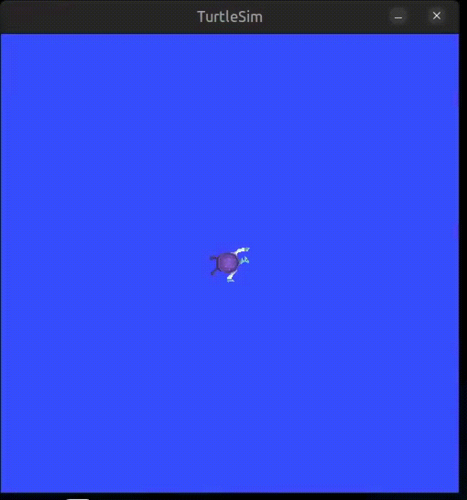


---

## Лабораторная работа №2

### Задание

Расширить программу из лаб 1: вводить данные о положении и скорости черепашки в **абсолютной системе координат** (вариант 3 — абсолютные), выводить сообщения о достижении вершин фигуры.

### Реализация

**Файл:** [`turtle_var3_lab2.py`](workspace/src/my_turtle_controller/my_turtle_controller/turtle_var3_lab2.py)

Добавлена подписка на топик `/turtle1/pose` (`turtlesim/msg/Pose`). Поля сообщения:

| Поле | Описание |
|------|----------|
| `x`, `y` | Абсолютная позиция. Диапазон `[0, 11.09]`, начало — нижний левый угол окна |
| `theta` | Угол в радианах, диапазон `[-π, π]` |
| `linear_velocity` | Фактическая линейная скорость из симулятора |
| `angular_velocity` | Фактическая угловая скорость из симулятора |

Управление движением осталось таймерным (из лаб 1). `pose_callback` служит только для чтения данных и логирования. Сообщения о вершинах выводятся при переключении состояний в `move_turtle`.

### Запуск

```bash
ros2 run turtlesim turtlesim_node
ros2 run my_turtle_controller turtle_var3_lab2
```

### Демонстрация

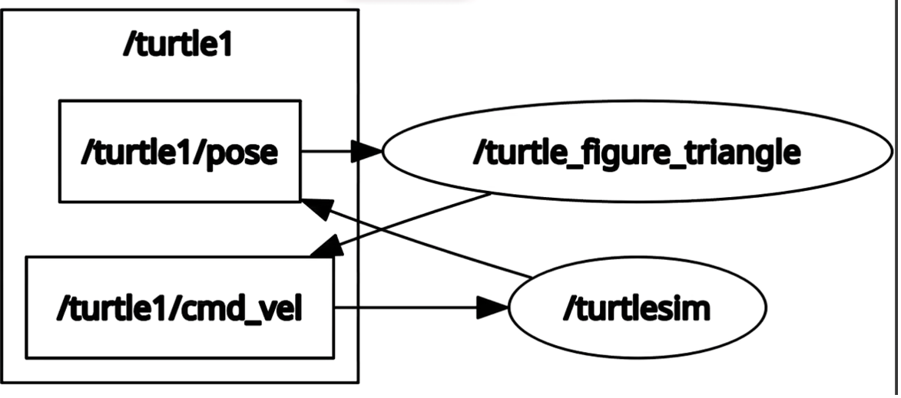


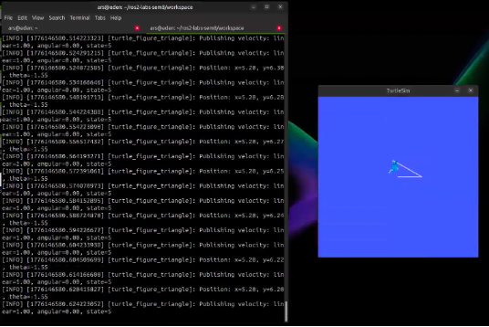


---

## Лабораторная работа №3

### Задание

Управление черепашкой по **обратной связи** — использовать данные о реальном положении из лаб 2 для регулирования вместо таймеров. При завершении миссии остановить черепашку.

### Реализация

**Файл:** [`turtle_var3_lab3.py`](workspace/src/my_turtle_controller/my_turtle_controller/turtle_var3_lab3.py)

Ключевое отличие от лаб 2: вместо `elapsed > t` проверяется расстояние до цели и угловая ошибка.

Условие продолжения движения вперёд:

$$d = \sqrt{(x_{goal} - x)^2 + (y_{goal} - y)^2} > \varepsilon$$

Условие продолжения поворота:

$$|\theta_{goal} - \theta_{current}| > \varepsilon_\theta$$

При $d \leq \varepsilon$ или $|\Delta\theta| \leq \varepsilon_\theta$ состояние переключается. Это делает траекторию точной независимо от задержек и вычислительного дрейфа.

Координаты вершин вычисляются аналитически в `__init__` из геометрии треугольника:

| Вершина | $x$ | $y$ | $\theta_{цели}$ |
|---------|-----|-----|-----------------|
| Старт | 5.544 | 5.544 | $0$ |
| V1 | 7.544 | 5.544 | $\pi - 30° = 2.618$ рад |
| V2 | 5.544 | 6.698 | $-\pi/2$ |
| V3 = Старт | 5.544 | 5.544 | $0$ |

Параметры допуска: $\varepsilon = 0.05$, $\varepsilon_\theta = 0.05$ рад.

### Запуск

```bash
ros2 run turtlesim turtlesim_node
ros2 run my_turtle_controller turtle_var3_lab3
```

### Демонстрация

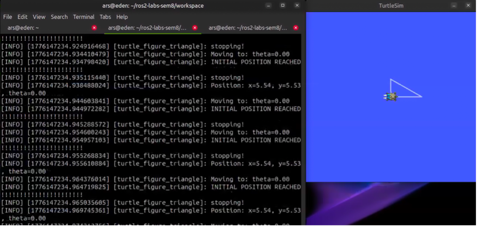


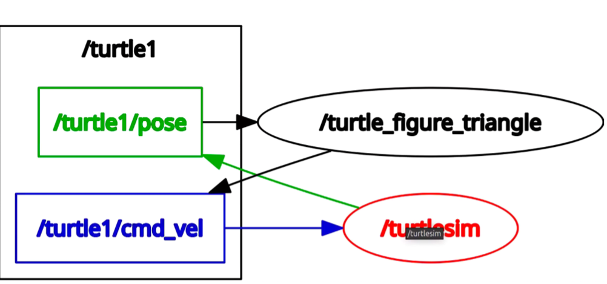


---

## Лабораторная работа №4

### Задание

Взаимодействие **клиент-сервис** с симулятором:
1. Сброс положения черепашки при запуске узла
2. Смена цвета пера при смене направления движения
3. Сброс позиции через 60 секунд после возврата в начальную точку

Для движения используется алгоритм из лаб 3.

### Реализация

**Основная нода:** [`turtle_var3_lab4.py`](workspace/src/my_turtle_controller/my_turtle_controller/turtle_var3_lab4.py)

**Сервер телепортации:** [`turtle_control_server.py`](workspace/src/my_turtle_server/my_turtle_server/turtle_control_server.py)

**Кастомный сервис:** [`SendToHome.srv`](workspace/src/my_turtle_interface/srv/SendToHome.srv)

#### Используемые сервисы turtlesim

| Сервис | Тип | Назначение |
|--------|-----|------------|
| `/reset` | `std_srvs/Empty` | Сброс черепашки и очистка холста |
| `/turtle1/set_pen` | `turtlesim/SetPen` | Смена цвета и толщины пера |
| `/turtle1/teleport_absolute` | `turtlesim/TeleportAbsolute` | Телепортация без очистки (в сервере) |

#### Логика смены пера

Метод `update_pen_for_direction(turning: bool)` отслеживает флаг `is_turning` и срабатывает только при **смене режима**, не спамя сервис на каждый тик:

- Прямолинейное движение → новый цвет из цикла `[белый, зелёный, белый, ...]`
- Поворот → перо выключается (`off=1`)

Перо выключается во время поворотов, а не красится красным — потому что turtlesim рисует точку если черепаха стоит на месте с опущенным пером.

#### Логика 60-секундного сброса

При достижении финального состояния фиксируется `home_reached_time`. В каждом тике проверяется:

$$\Delta t = t_{current} - t_{home} \geq 60\ \text{с}$$

После этого вызывается `/reset` и машина состояний перезапускается.

#### Сервер SendToHome

Предоставляет сервис `/send_to_home` — телепортирует черепашку в $(5.544,\ 5.544,\ 0)$ без очистки холста. Можно вызвать вручную из терминала независимо от основной ноды.

### Запуск

```bash
# терминал 1
ros2 run turtlesim turtlesim_node

# терминал 2
ros2 run my_turtle_controller turtle_var3_lab4

# терминал 3 — опционально, сервер ручной телепортации
ros2 run my_turtle_server turtle_control_server

# вызвать SendToHome вручную из любого терминала
ros2 service call /send_to_home my_turtle_interface/srv/SendToHome
```

### Демонстрация

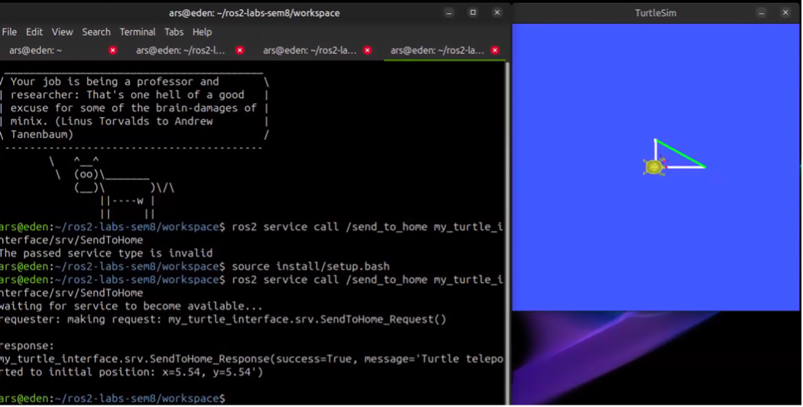


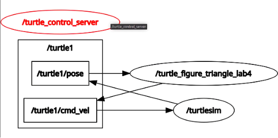


---

## Лабораторная работа №5

### Задание

Взаимодействие через **ROS 2 Actions**:
1. Управление по положению (алгоритм лаб 3), траектория из лаб 1
2. Feedback при достижении каждой вершины
3. Result при возврате в исходную точку

### Реализация

**Action client:** [`turtle_var3_lab5.py`](workspace/src/my_turtle_controller/my_turtle_controller/turtle_var3_lab5.py)

**Action server:** [`turtle_action_server.py`](workspace/src/my_turtle_server/my_turtle_server/turtle_action_server.py)

**Кастомный action:** [`DrawFigure.action`](workspace/src/my_turtle_interface/action/DrawFigure.action)

#### Формат DrawFigure.action

```
# goal — пустой, просто запуск миссии
---
# result
bool success
string message
---
# feedback
int32 vertex_reached
string status
```

#### Зачем Actions, а не Services?

| | Service | Action |
|--|---------|--------|
| Ответ | Один, блокирующий | Промежуточные feedback + финальный result |
| Отмена | Невозможна | Можно отменить goal |
| Применение | Быстрые операции | Долгие задачи с прогрессом |

Сервер использует `MultiThreadedExecutor` — это обязательно, чтобы `pose_callback` продолжал срабатывать пока `execute_callback` заблокирован в цикле управления.

#### Схема взаимодействия

```
client                       server
  │── send_goal ─────────>     │
  │<── goal accepted ──────────│
  │<── feedback (vertex=1) ────│   достигнута вершина 1
  │<── feedback (vertex=2) ────│   достигнута вершина 2
  │<── feedback (vertex=3) ────│   достигнута вершина 3
  │<── result (success=True) ──│   миссия завершена
```

### Запуск

```bash
# терминал 1
ros2 run turtlesim turtlesim_node

# терминал 2 — action server (должен быть запущен первым)
ros2 run my_turtle_server turtle_action_server

# терминал 3 — action client (отправляет цель и ждёт результата)
ros2 run my_turtle_controller turtle_var3_lab5
```

### Демонстрация

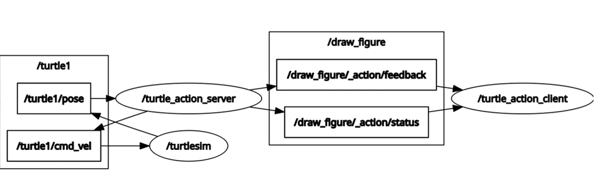


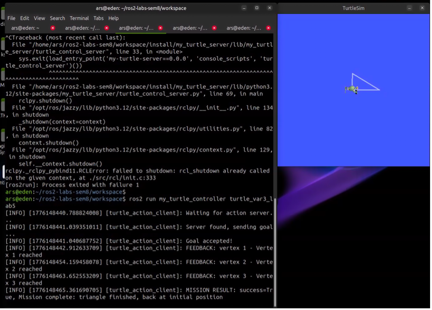


---

## Лабораторная работа №6

### Задание

Доработка лаб 3 с введением **ROS 2 параметров**. Вариант 3 — параметры задают координаты вершин фигуры.

### Реализация

**Файл:** [`turtle_var3_lab6.py`](workspace/src/my_turtle_controller/my_turtle_controller/turtle_var3_lab6.py)

#### Параметры

| Параметр | Тип | По умолчанию | Описание |
|----------|-----|--------------|----------|
| `vertex1_x` | `float64` | `7.544` | X-координата вершины 1 |
| `vertex1_y` | `float64` | `5.544` | Y-координата вершины 1 |
| `vertex2_x` | `float64` | `5.544` | X-координата вершины 2 |
| `vertex2_y` | `float64` | `6.698` | Y-координата вершины 2 |

Третья вершина фиксирована — стартовая точка $(5.544,\ 5.544)$.

#### Ключевые отличия от лаб 3

**Углы через `atan2`** — в лаб 3 углы захардкожены под конкретный треугольник. При произвольных вершинах углы поворота вычисляются из координат:

$$\theta_{V1} = \text{atan2}(y_{V1} - y_0,\ x_{V1} - x_0)$$

$$\theta_{V2} = \text{atan2}(y_{V2} - y_{V1},\ x_{V2} - x_{V1})$$

$$\theta_{V3} = \text{atan2}(y_0 - y_{V2},\ x_0 - x_{V2})$$

**Нормализация угла** — в лаб 3 черепаха могла крутиться в неправильную сторону при $|\Delta\theta| > \pi$. Добавлена нормализация в $[-\pi,\ \pi]$:

$$\Delta\theta_{norm} = ((\Delta\theta + \pi) \bmod 2\pi) - \pi$$

Направление вращения определяется знаком:

$$\omega = \omega_{max} \cdot \text{sign}(\Delta\theta_{norm})$$

**7 состояний** вместо 6 — добавлен начальный поворот к первой вершине, т.к. теперь V1 может быть в любом направлении, а не только прямо вперёд.

### Запуск

```bash
# с параметрами по умолчанию (воспроизводит лаб 3)
ros2 run my_turtle_controller turtle_var3_lab6

# произвольный треугольник
ros2 run my_turtle_controller turtle_var3_lab6 --ros-args \
  -p vertex1_x:=8.0 -p vertex1_y:=3.0 \
  -p vertex2_x:=3.0 -p vertex2_y:=9.0

# посмотреть текущие параметры ноды
ros2 param list /turtle_figure_triangle_lab6
ros2 param get /turtle_figure_triangle_lab6 vertex1_x
```

### Демонстрация

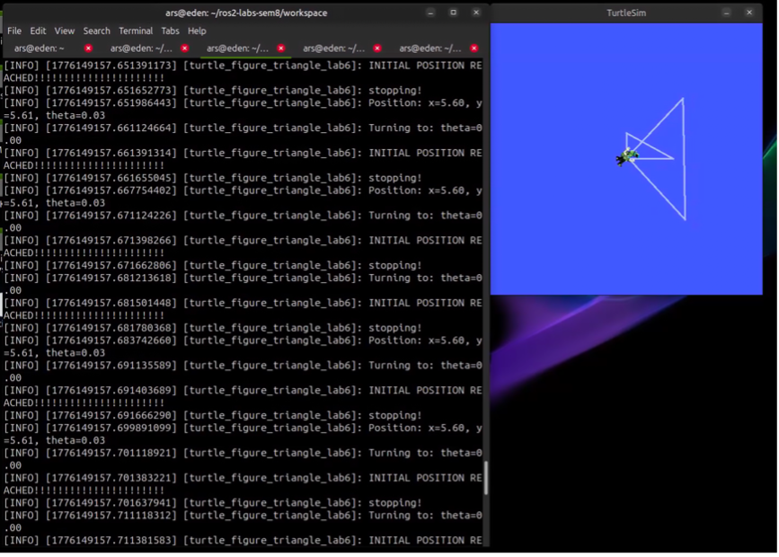


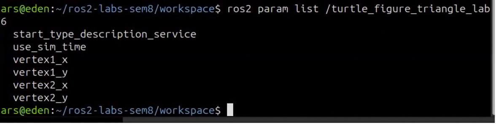


---

## Лабораторная работа №7

### Задание

Доработка лаб 3 с созданием **собственного типа сообщения**. Вариант 3 — сообщение содержит пройденный путь, максимальную и минимальную скорости движения.

### Реализация

**Файл ноды:** [`turtle_var3_lab7.py`](workspace/src/my_turtle_controller/my_turtle_controller/turtle_var3_lab7.py)

**Кастомное сообщение:** [`TurtleStats.msg`](workspace/src/my_turtle_interface/msg/TurtleStats.msg)

#### TurtleStats.msg

```
float64 distance_traveled    # суммарный пройденный путь, м
float64 max_speed            # максимальная линейная скорость, м/с
float64 min_speed            # минимальная ненулевая линейная скорость, м/с
```

#### Сбор данных

**Пройденный путь** — накапливается в `pose_callback` как сумма евклидовых расстояний между последовательными позициями:

$$S = \sum_{i}\ \sqrt{(\Delta x_i)^2 + (\Delta y_i)^2}$$

**Скорости** — читаются из поля `linear_velocity` топика `/turtle1/pose`. Turtlesim записывает туда фактическую скорость симуляции. Нулевые значения во время поворотов (черепаха стоит на месте) в минимальную скорость **не включаются**.

#### Публикация

Сообщение `TurtleStats` публикуется в топик `/turtle1/stats` с частотой **1 Гц** через отдельный таймер — независимо от основного цикла управления на 100 Гц.

### Запуск

```bash
# терминал 1
ros2 run turtlesim turtlesim_node

# терминал 2
ros2 run my_turtle_controller turtle_var3_lab7

# терминал 3 — смотреть статистику в реальном времени
ros2 topic echo /turtle1/stats
```

### Демонстрация

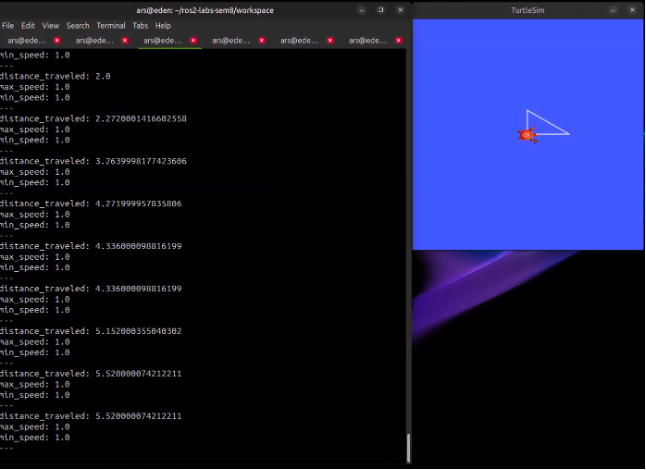


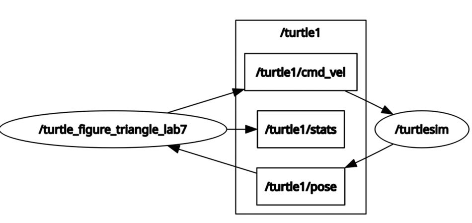


---

## Общие команды

```bash
# список активных нод
ros2 node list

# список активных топиков
ros2 topic list

# список активных сервисов
ros2 service list

# граф нод и топиков
rqt_graph

# echo любого топика
ros2 topic echo /turtle1/pose
ros2 topic echo /turtle1/stats

# информация о ноде
ros2 node info /turtle_figure_triangle_lab7
```
